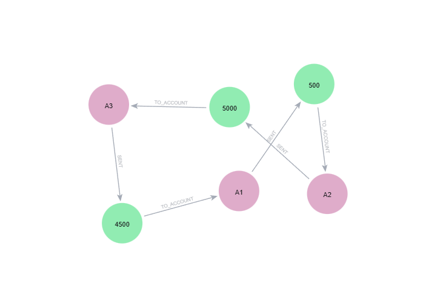
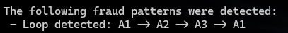

## Fraud Detection Demo (Neo4j + Python)

This project is a small, self‑contained demo showing how to model financial transactions in Neo4j and detect simple fraud patterns using Python. It focuses on clarity, reproducibility, and a clean end‑to‑end workflow rather than production‑scale complexity.

The goal of this project is to demonstrate:
- How to model accounts, customers, devices, merchants, and transactions in Neo4j
- How to query the graph using Cypher
- How to run those queries from Python
- How to detect a basic fraud pattern (transaction loops)
- How to structure a small Python project cleanly

### Graph Schema

The Neo4j graph uses the following node labels:
- Account
- Customer
- Device
- Merchant
- Transaction
And the following relationship types:
- (:Customer)-[:OWNS]->(:Account)
- (:Customer)-[:USES]->(:Device)
- (:Account)-[:SENT]->(:Transaction)
- (:Transaction)-[:TO_ACCOUNT]->(:Account)
- (:Transaction)-[:TO]->(:Merchant)
This structure supports modeling money movement, customer behavior, and device/merchant interactions.

### Project Structure
app/
  app.py
  src/
    __init__.py
    db.py
    queries.py
    analysis.py

- db.py — Neo4j driver + helper to run Cypher queries
- queries.py — Cypher queries used by the project
- analysis.py — Python functions that wrap the queries
- app.py — Main script that runs the demo

### Setup

1.  Install dependencies
  - Python 3.10+
  - Neo4j Desktop 2.1.1
  - pip install -r requirements.txt

2.  Load database from data/dumps
  - import neo4j.dump
  OR
  - create local database and run queries from data/seed/seed_data.cypher
  - start Neo4j instance and ensure it is running at bolt://localhost:7687

3.  Create credentials file in src directory
  - Name the file .env
  - include:
      NEO4J_USER = {database_username}
      NEO4J_PASSWORD = {database_password}
  - save the file

4.  Run the demo
  - In CLI, navigate to the project root
  - Run "python app/app.py"

### How It Works

1.  Python send Cypher quries to Neo4j using the official Neo4j Python driver
2.  After verifying the connection, Accounts, Transactions, Edges and Loops are printed to the console
3.  Unique loops are printed to the console in a human-readable format

### Future Enhancement Considerations
  * Add merchant-based fraud patterns
  * Add device-based fraud patterns
  * Add velocity checks
  * Add multi-hop laundering detection
  * Add CSV ingestion
  * Add visualization
  * Expose querying via Flask API